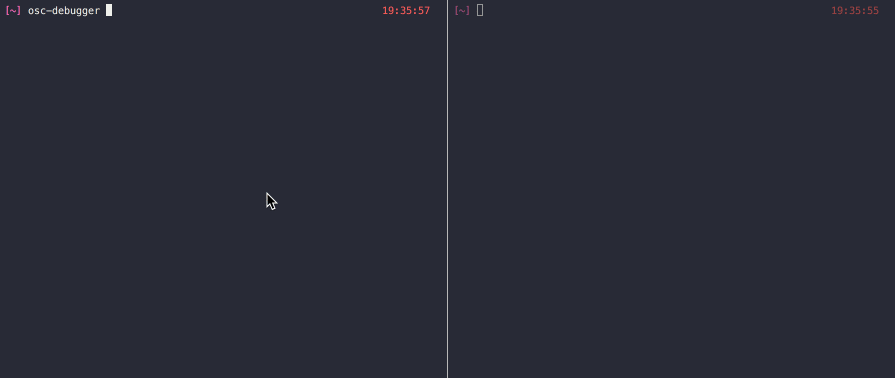

# osc-debugger



`osc-debugger` is a – 🥁 – OSC debugger for the terminal. No results came up when I search for "osc debugger" on npm's website, so I figured there wasn't one.

It has two dazzlingly simple features:

* Monitor OSC messages (over UDP) sent to a port
* Send OSC messages (over UDP) to a port

## Installation

This thingamajiggy is meant to live globally and happily in your terminal environment. So I would suggest you

```sh
npm i -g osc-debugger
```

with that shiny `-g` flag.

## Usage

🎶 _Try with a little `osc-debugger --help` from my friends._ 🎶

### Interactive mode

If you were brave enough to install `osc-debugger` onto your system, then you are free to

```sh
osc-debugger
```

in your terminal. From there you will be escorted to your destination.

### CLI commands

If you know where you are going and don't need that escort, you can

```sh
# Start a monitor
osc-debugger monitor -p 6666

# Start a sending session
osc-debugger send -p 6666 -a 192.168.0.666
```
